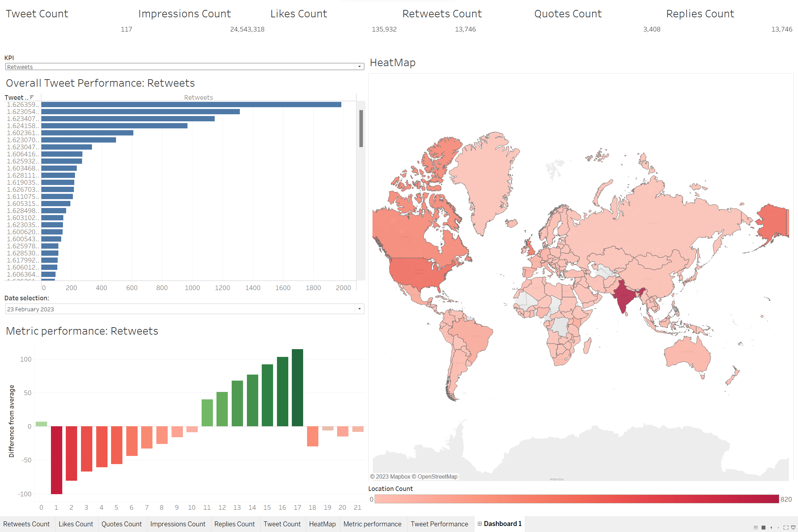

# Twitter-Tableau-Project
## Summary
This project completed as part of my final year studies collects data from the Twitter API on a selected account and collects publicly available data including tweet outreach and performance. Information is only collected on tweets created and not those which are retweeted by the account.

A dashboard collects the findings plotting a heatmap of the tweets outreach, a time profile for each KPI and the overall performance. Microsoft used as an example for its global prominence and volume of tweet information. Ultimately the goal is to provide a summarisation of a twitter account which could be used for marketing purposes. 

An extensive document explaining all the details of this project and how it was completed can be provided on request.

## Key Points
* Extract data from the Twitter API

Data was retrieved using a Python tool, Tweepy, the results then cleaned and stored in 2 JSON schemas. 1 for the tweet performance and another for the geographic reach. 

* KPIs

Account performance is measured through the following indicators: Impressions (Views), Likes, Quotes, Replies and Retweets. Selecting in one location on the dashboard modifies the time profile and tweet performance.

* Time Profile

The time profile represents an hourly interactivity per KPI for each tweet or as a collective. The aim being this would be able to influence when a good time to release would be based on the viewers of the account to maximise reach. For example, you can see what hour in the day the tweet is most retweeted. This visualisation improved the longer the data is being collected from the API, the images only show a snapshot and gaps exist in the time profile.

* Heatmap Visualisation

After cleansing the data and removing erroneous locations the count of likes is represented through a heatmap providing the reach of a twitter account. Each tweet can then be visualised individually or as a collective for account performance.

## Images 
Image of the dashboard:

Individual selection of Tweet:

